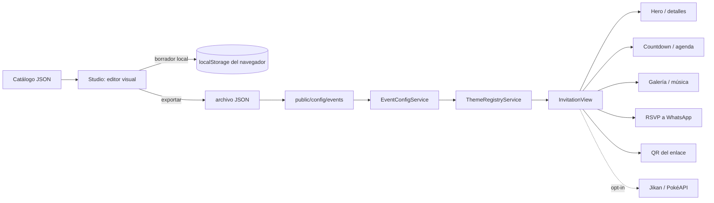

# Invitation Studio

Invitation Studio es una plataforma Angular para generar invitaciones y experiencias digitales desde documentos JSON y una configuración visual. Parte de la aplicación standalone existente de Mariachi Mexicanísimo: se conserva su landing, sus formularios, galería y recursos locales como una plantilla comercial dentro del sistema.

## Requisitos

- Node.js `^22.22.3 || ^24.15.0 || ^26.0.0` y npm 10 o superior.
- Angular 22.2 y TypeScript 6.

La compatibilidad de Node/TypeScript sigue la [tabla oficial de Angular](https://angular.dev/reference/versions). El proyecto se fijó en Angular 22.2.2.

## Inicio rápido

```bash
npm ci
npm start
```

Abre `http://localhost:4200`. Comandos adicionales:

```bash
npm run build                 # build de producción con PWA
npm run build:production      # alias explícito del build de producción
npm run check:config          # verifica catálogo y archivos JSON
npm run analyze               # build con stats JSON
```

## Rutas

| Ruta | Función |
| --- | --- |
| `/` | Catálogo y presentación de Invitation Studio |
| `/studio` | Editor visual, editor JSON, importación/exportación y vista previa local |
| `/i/:slug` | Invitación pública renderizada según el JSON publicado |
| `/mariachi` | Landing comercial existente de Mariachi Mexicanísimo |
| `/galeria`, `/contacto`, `/reservar` | Rutas comerciales existentes, lazy-loaded |

Las páginas feature se cargan con `loadComponent`, y las vistas de plantilla cargan únicamente los datos JSON del evento seleccionado.

## Arquitectura

```text
src/app/
├── core/                       contratos, carga/validación JSON y SEO
├── features/
│   ├── studio/                 catálogo y editor visual/JSON (Signals)
│   ├── invitation/             página y renderer por secciones
│   ├── themes/                 catálogo de temas y variables CSS
│   ├── integrations/           módulos opcionales Jikan y PokéAPI
│   ├── home/                   landing comercial existente de Mariachi
│   ├── gallery/ contact/ booking/
│   └── shared/                 formularios y utilidades existentes
├── app.routes.ts               routing lazy
└── main.ts                     HTTP, router y Service Worker
public/
├── config/events/              catálogo y configuraciones publicables
├── images/mariachi/            fotografías existentes del negocio
├── music/                      reservado para audio local
└── manifest.webmanifest
```



## Configuración sin cambiar TypeScript

El catálogo es `public/config/events/index.json`. Cada tarjeta apunta a un archivo con el mismo slug dentro de `public/config/events/`. Las plantillas incluidas son:

- `emiliano-ulises.json`: cumpleaños infantil en Cocotitlán, Estado de México. La fecha, hora y dirección quedan pendientes de proporcionar; no se inventan.
- `mariachi-mexicanisimo.json`: plantilla comercial que conserva fotos locales y lleva a la zona de servicio de la landing existente.

El editor `/studio` permite modificar texto, fecha, hora, ubicación, tema, colores, visibilidad de secciones, imagen, historias, galería, audio, WhatsApp RSVP y las integraciones. **Guardar vista previa** almacena un borrador solo en el navegador actual; **Descargar JSON** genera el artefacto portable. Para publicarlo, copia el JSON exportado a `public/config/events/<slug>.json` y agrega su entrada en `index.json`; despliega una compilación nueva. Los archivos publicados son configuración fuente y no requieren cambios en los componentes.

La forma tipada documentada está en `src/app/core/invitation.models.ts`. Ejemplo mínimo:

```json
{
  "schemaVersion": 1,
  "slug": "emiliano-ulises",
  "eventType": "birthday",
  "title": "Cumpleaños de Emiliano Ulises",
  "subtitle": "¡Estás invitado a celebrar!",
  "description": "Acompáñanos en Cocotitlán.",
  "date": "",
  "time": "",
  "timezone": "America/Mexico_City",
  "location": "Cocotitlán, Estado de México",
  "address": "",
  "mapUrl": "https://www.google.com/maps/search/?api=1&query=Cocotitlan",
  "theme": "kids",
  "hostName": "Familia de Emiliano",
  "sections": { "countdown": false, "story": false, "details": true, "gallery": false, "map": true, "gifts": false, "rsvp": true, "timeline": false, "music": false, "openData": false },
  "story": [], "gallery": [], "timeline": [],
  "music": { "enabled": false, "src": "", "title": "" },
  "gifts": { "enabled": false, "message": "", "links": [] },
  "rsvp": { "enabled": true, "fields": ["name", "attending", "guests", "comments"], "successMessage": "¡Gracias por responder!" },
  "openData": { "enabled": false, "jikan": false, "pokeApi": false },
  "seo": { "title": "Invitación", "description": "Detalles de la celebración." }
}
```

Campos de imagen/audio usan archivos locales en `public/`: por ejemplo `/images/eventos/foto.webp` o `/music/tema.mp3`. Siempre escribe texto alternativo para fotografías. Se permite URL HTTPS para imágenes aprobadas. El Service Worker precarga shell y configuración; imágenes y música se descargan bajo demanda.

## Temas

`ThemeRegistryService` define diez tokens listos: Elegant, Luxury, Floral, Kids, Minions, Superheroes, Princess, Space, Safari y Mexican. Cada tema registra paleta, colores de texto/superficie, tipografías seguras, motivos y ambiente. `colors` permite overrides por evento. Los componentes leen las propiedades `--invite-*`, por lo que un nuevo tema o ajuste de paleta no obliga a duplicar el renderer.

## Secciones de invitación

El renderer es standalone y orientado a configuración: hero, countdown, story, detalles, mapa externo, agenda, galería, regalos, RSVP, música, contenido API, QR y footer. `sections.<id>` habilita cada módulo. Las fotografías se sirven con `NgOptimizedImage` y carga diferida; el audio usa controles nativos con `preload="none"`. No hay reproducción automática.

## RSVP y QR

El RSVP valida nombre y asistencia, y construye una respuesta destinada al WhatsApp que se configure en `rsvp.whatsappNumber`. El formulario no envía datos a un servidor ni afirma haber reservado un lugar; es responsabilidad del anfitrión revisar la conversación. Si se necesita recolección central, agrega un endpoint autenticado/protegido, consentimiento y política de retención antes de guardar datos personales.

El QR codifica la URL que está abierta usando QRServer. Para controlar disponibilidad o evitar solicitudes a terceros, reemplaza el generador por un paquete local como `qrcode` y añade el QR generado a assets.

## APIs open source

- **Jikan**: endpoint público de información de anime (`api.jikan.moe`), sin credenciales. La llamada solo ocurre cuando la sección está habilitada y se pulsa el botón.
- **PokéAPI**: endpoint público de datos Pokémon (`pokeapi.co`), sin credenciales. La llamada es opcional, interactiva y no bloquea el render inicial.

Estas APIs son ejemplos temáticos para extensibilidad; no forman parte de los datos principales de RSVP ni se usan como base de negocio. Las respuestas pueden no estar disponibles, estar limitadas por frecuencia o cambiar externamente; se muestran estados de error y el resto de la invitación sigue funcionando.

## PWA, offline y SSR

El Service Worker se habilita solo en build de producción. `ngsw-config.json` precarga el shell y los JSON de plantilla, y cachea local-media de forma lazy. La estrategia `freshness` cachea respuestas de APIs por un día con `maxSize` acotado. Cambios a assets se publican con hashing y revisión de actualización estándar de Angular.

SSR no se configura en esta primera entrega porque las invitaciones admiten selección de JSON estático desde `/public`. Si SEO de cada slug requiere HTML inicial en servidor, habilita Angular SSR con `ng add @angular/ssr`, valida hidratación del renderer y protege usos de `window`/`localStorage` detrás de `isPlatformBrowser`.

## SEO y metadatos

`SeoService` actualiza title, description, OG, Twitter y JSON-LD según la invitación; usa `Event` para celebraciones y `LocalBusiness` en la plantilla comercial. El documento raíz ofrece valores fallback. Configura dominio canónico y un `seo.image` absoluta cuando estén disponibles, sin URLs inventadas. Para indexación prerenderizada por slug usa SSR/prerender.

## Despliegue

El proyecto compila como SPA Angular a `dist/mariachi-mexicanisimo/browser`. `vercel.json` ofrece rewrite SPA. Importa el repo en Vercel, selecciona Angular/Other según autodetección y configura `npm run build` con ese output. Para otros hosts usa fallback/rewrite a `index.html` (la configuración existente incluye Netlify y Azure Static Web Apps).

## Documentación ampliada

- `docs/architecture/OVERVIEW.md`
- `docs/architecture/CONFIGURATION.md`
- `docs/architecture/PWA_AND_INTEGRATIONS.md`
- `docs/architecture/ROADMAP.md`
- `docs/MIGRATION_IMPROVEMENTS.md` (documento histórico de la landing Mariachi)
- `RECOVERY_REPORT.md` (diagnóstico anterior de dependencias)

## Información pendiente

No se proporcionaron fecha, hora, dirección exacta ni contacto de la familia para la plantilla infantil; el archivo los deja vacíos. Las solicitudes RSVP no son persistidas en backend. No se garantiza una cifra Lighthouse antes de medir dominio, imágenes, servidor y modo de publicación. La app reutiliza la landing Mariachi tal como estaba, cuyos datos de atención existentes deben ser confirmados por el negocio antes de publicarse como plantilla.
