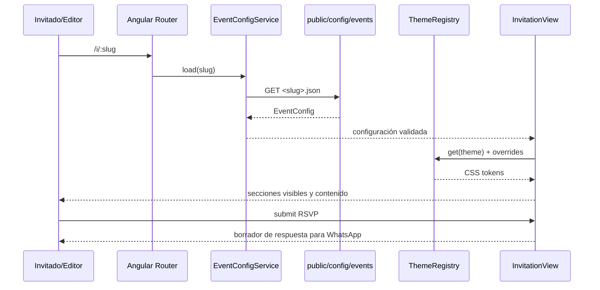

# Arquitectura de Invitation Studio

## Decisiones

- El workspace Angular standalone sirve el estudio y las invitaciones configuradas.
- El runtime lee contratos `EventConfig` desde `public/config/events/<slug>.json`; ningún dato principal del evento se acopla al renderer.
- El catálogo `index.json` se mantiene junto a las configuraciones y la validación reproducible revisa que ambos estén sincronizados.
- Angular Signals administran selección, estado de carga, formularios de editor y tokens; Router carga vistas por ruta bajo demanda.
- `ThemeRegistryService` mantiene la paleta por tema y overrides declarativos. Se usan custom properties en una raíz por invitación.
- El editor persiste vista previa en localStorage, y exporta un JSON para el proceso estático de publicación.
- Jikan y PokéAPI están aisladas en una sección y servicio opcionales; no afectan contenido RSVP ni el render inicial.
- Service Worker precarga el app shell y plantillas; medios se cachean bajo demanda.

## Diagrama de runtime

## Limitaciones de primera versión

No hay servidor de dashboard, autenticación, base de datos, subida de medios, entrega directa de invitaciones ni persistencia central de RSVP. El editor es local y de un navegador; publicar cambia recursos estáticos y requiere build/deploy. SSR es opcional y queda descrito en la guía operativa.
